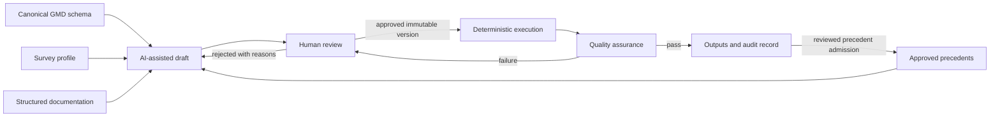

# GMD Harmonization Hub

The GMD Harmonization Hub is the central reference point for the AI-assisted
household survey harmonization system. It explains how the canonical schema,
survey intake and extraction, historical precedents, AI-assisted drafting,
human review, deterministic execution, quality assurance, and infrastructure
fit together.

This repository contains architecture, governance, interface contracts, and
decision rationale. It contains no pipeline code and no raw or harmonized
microdata.

## Repo map

The following is a working navigation map compiled from project materials. It
describes the intended role of each repository, but it is not an approved
ownership register. Physical repository URLs and accountable methodological,
technical, and support owners remain open until they are confirmed in the
canonical architecture and implementation handoff.

| Repository | Role in the system |
|---|---|
| `GMD-canonical-schema` | The authoritative GMD schema and harmonization rulebook. It governs how GMD variables are defined and built. |
| `survey-scribe` | Extracts structured survey profiles from raw questionnaire PDFs and related documentation. |
| `harmonization-specs` | Holds per-survey, per-variable harmonization decisions that are drafted with AI and approved by humans. |
| `GMD-KnowledgeBase-Pilot` | An exploratory pilot that informed the CVS design; it is historical and is not part of the production pipeline. |
| `GMD-harmonization-hub` | This repository: it explains how the system fits together and preserves its architecture and reasoning. |

## Start here

**New to the team.** Read the [glossary](glossary_and_questions/glossary.md),
then review the repo map and the canonical documents below.

**A regional focal point.** See [guidance for collaborators](for_collaborators/)
for the role of methodological rules and decisions before they reach the CVS.

**ITS.** See [guidance for collaborators](for_collaborators/) for a plain-language
summary of infrastructure needs, and review the [open questions](glossary_and_questions/open_questions.md)
for unresolved items.

**A GPID teammate joining the project.** Start with the
[architecture decisions](architecture_decisions/) to understand what has
already been settled and why.

For a component-by-component orientation map, see
[system_map.md](system_map.md). It is supporting documentation and does not
override the canonical documents.

## Canonical documents

Only the following three documents are canonical:

| Document | Authority |
|---|---|
| `README.md` | Repository purpose, navigation, document policy, and authority hierarchy |
| `canonical/system-architecture.qmd` | Logical architecture, governance, lifecycle, trust boundaries, and artifact contracts |
| `canonical/infrastructure-requirements.qmd` | Technical requirements, candidate services, decision status, and questions for ITS |

The two Quarto documents are the only substantive sources of truth in this
repository. Slides, proposals, meeting notes, and rendered files are
adaptations or historical records. They must not introduce decisions that are
absent from the canonical documents.

## Authority hierarchy

When sources disagree, use this order:

1. Approved GMD methodology and the canonical GMD schema govern statistical
   definitions and validation rules.
2. `canonical/system-architecture.qmd` governs system behavior, roles,
   approval gates, and artifact contracts.
3. `canonical/infrastructure-requirements.qmd` governs infrastructure
   capabilities and records whether implementation choices are approved or
   only proposed.
4. Approved, quality-assured historical decisions are advisory precedents.
5. Archived documents provide context only and have no current authority.

An inconsistency with a higher-level source must be surfaced and resolved. It
must never be handled through an implicit fallback.

## System at a glance



The central control rule is simple: AI may draft and diagnose, but it cannot
approve methodology or authorize production execution. Production runs only
an exact, human-approved specification with versioned deterministic code.

## Repository boundaries

This hub owns:

- the cross-system architecture and design principles;
- the definition of governance gates and decision rights;
- the minimum contracts exchanged between system components;
- infrastructure requirements and the status of proposed choices; and
- the rationale and open questions that must survive team transitions.

This hub does not own:

- the canonical statistical definitions themselves;
- survey files or respondent-level data;
- pipeline, application, model, or infrastructure code;
- operational secrets or environment configuration; or
- implementation-specific runbooks maintained by component owners.

The physical repositories and named owners for implementation components have
not yet been formally recorded. That gap is explicit in the architecture
document and should be resolved before implementation responsibilities are
assigned.

## What this repository does not contain

No harmonization rules, pipeline code, survey files, or respondent-level data
are stored here. Those belong in the appropriate satellite repositories and
controlled systems. This hub explains and connects the system; it does not
decide statistical methodology or execute harmonization runs.

## Document status vocabulary

- **Invariant:** mandatory system property derived from project governance.
- **Approved:** explicitly accepted by the accountable owner.
- **Proposed:** a recommendation awaiting approval.
- **Open:** unresolved and not safe to assume.
- **Archived:** retained for provenance but superseded and noncanonical.

Named technologies in the infrastructure document are candidates unless their
status is explicitly `Approved`.

## Repository layout

```text
.
|-- README.md
|-- canonical/
|   |-- system-architecture.qmd
|   `-- infrastructure-requirements.qmd
|-- architecture_decisions/
|-- diagrams/
|-- for_collaborators/
|-- glossary_and_questions/
|-- archive/
|   `-- 2026-07-29-initial-consolidation/
|-- compound-gpid.md
|-- compound-gpid.context.md
|-- system_map.md
|-- roadmap.json
`-- sync_status/
```

The architecture decisions, collaborator guidance, glossary, open questions,
diagrams, and synchronization notes support the canonical documents but do not
override them. The Compound GPID files and roadmap are workflow metadata, not
GMD system documentation. The dated archive preserves the drafts,
presentations, rendered outputs, and assets that informed the first canonical
consolidation.

## Maintenance policy

1. Update the appropriate canonical document before updating an adaptation.
2. Record unresolved matters as `Open`; do not write proposed behavior as fact.
3. Any change to a system invariant, approval gate, trust boundary, or artifact
   contract requires review by the relevant methodological and technical owners.
4. Give stakeholder adaptations a date and audience, and derive them from the
   canonical sources.
5. Move superseded sources and renders into a dated archive. Do not delete
   historical material that explains a decision.
6. Keep generated HTML, PDF, DOCX, and presentation files outside the canonical
   directory. A render is never a source of truth.

## Documentation smoke checks

For navigation or link-oriented documentation changes, run a quick smoke check
before merge:

```sh
test -f README.md
test -f system_map.md
test -f glossary_and_questions/glossary.md
test -f glossary_and_questions/open_questions.md
grep -n '\[system_map.md\](system_map.md)' README.md
```

For canonical-source edits, also run the Quarto render commands in the next
section as a render smoke check.

## Rendering

Quarto is required to render the canonical sources. From the repository root:

```sh
quarto render canonical/system-architecture.qmd --to html \
    --output-dir ../build -M embed-resources:true
quarto render canonical/infrastructure-requirements.qmd --to html \
    --output-dir ../build -M embed-resources:true
```

Quarto resolves `--output-dir` relative to the input document, so these commands
write to the repository-level `build/` directory. Rendered files are for review
or distribution and should be archived or published separately rather than
treated as canonical source. The `build/` directory and Quarto's local caches
are ignored; neither is a source of truth.

## Consolidation record

The repository was first consolidated on 2026-07-29. Eight authored Quarto
files and their generated outputs were moved intact to
`archive/2026-07-29-initial-consolidation/`. The archive manifest records the
original locations, duplicate files, and substantive conflicts found during
the review.