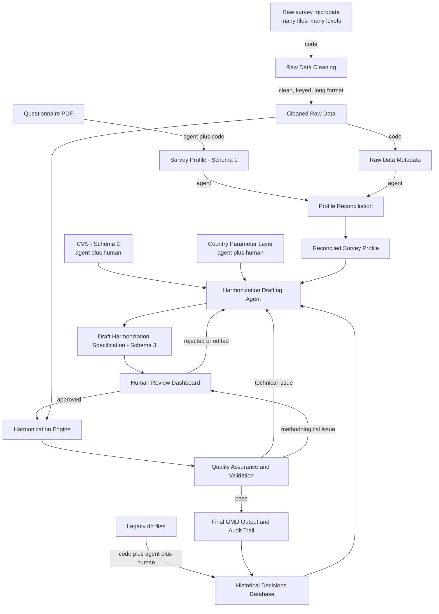

# GMD AI Harmonization: System Components Map

This document lists every piece of the system, what it holds, what it is
made of (agent, code, human review, or a mix), and how it connects to the
others. It is not exhaustive on methodology, it is meant as a map so we do
not lose track of the moving parts.

Status note. This is a supporting map for orientation. It does not define
system invariants or replace the canonical architecture documents. If this
map conflicts with canonical sources, canonical sources and approved
architecture decisions take precedence.

A note on composition: almost nothing here is purely agentic or purely
code. Most pieces are agent plus code, or agent plus human review. The
table at the end marks this explicitly for every piece.

Related reading. For why a given piece works the way it does, see
[architecture_decisions/](architecture_decisions/). For definitions of the
terms used here, see
[glossary_and_questions/glossary.md](glossary_and_questions/glossary.md).

---

## 1. Inputs (raw material, not yet processed)

- **Survey questionnaire (PDF)**: the paper trail of what was asked in the
  field.
- **Raw survey microdata**: the actual survey data files, in varying
  formats (CSV, DTA, SQL, and others), usually split across several files,
  and each file sitting at a different level (household level, individual
  level, item or consumption level). This data is typically messy on
  arrival.
- **Legacy harmonization do files**: old Stata scripts that encode how
  previous harmonizers solved this survey or a similar one.
- **Country specific information**: anything about a country that is not
  in the questionnaire itself (education system structure, currency,
  administrative divisions, known quirks).

## 2. Raw Data Cleaning

Code that takes the raw, messy, multi file, multi level survey data and
turns it into one clean, standardized file: a well structured long format
with clear keys, so the household level, individual level, and item level
files can be reliably merged. This step does not touch methodology, it
only standardizes structure.

## 3. Raw Data Metadata (Raw Data Profile)

Generated from the cleaned raw data by code. Includes summary statistics,
non response counts, missing data patterns, variable labels, and variable
names. This is a factual description of what is actually present in the
data, independent of what the questionnaire says should be there.

## 4. Survey Profile (Schema 1)

A structured JSON representation of what the questionnaire describes:
variable names, question wording, response codes, skip patterns. Built
from the questionnaire PDF through the Surveyscribe pipeline, which
combines an agent (to interpret the document) with code (to structure and
validate the output). It describes the survey as designed, not yet as
collected.

## 5. Profile Reconciliation (agent)

An agent step that cross references the Survey Profile (4, what the
questionnaire says) against the Raw Data Metadata (3, what the data
actually contains), to catch mismatches and produce one combined, verified
profile of the survey. This reconciled profile is what downstream steps
use, rather than either source alone.

## 6. Canonical Variable Schema, CVS (Schema 2)

The GMD rulebook. One record per GMD variable: definition, allowed values,
construction rules, and which variables it derives from or feeds into.
Universal across countries, contains no country specific content. Drafted
by an agent from the GMD guidelines, then confirmed through human review.
Always authoritative once approved.

## 7. Country Parameter Layer (lookup tables)

A separate, sparse layer that holds the country specific parameters the
CVS deliberately leaves out (for example, years per grade level in a given
country's education system). Drafted by an agent, but requires a
substantial amount of human review given how easy it is to get country
specific detail wrong. Referenced by the CVS by ID, but stored and
versioned on its own.

## 8. Historical Decisions Database (vector database)

A record of past harmonization decisions: what was mapped, how, why, and
any human override with its justification. Legacy do files feed into this
through a pipeline that is code (parse the script), agent (interpret what
it does), and human (validate the interpretation) in sequence, before
anything is stored. This is advisory only, it offers precedents, never
binding rules.

## 9. Harmonization Specification Schema (Schema 3)

The template that a specific mapping decision, for a specific survey and
variable, must follow: which raw variable maps to which GMD variable, what
transformation applies, which situation it falls under (direct mapping,
inferred with conversion, or missing with a documented reason), and space
for human approval or override.

## 10. Harmonization Drafting Agent

The main orchestrating agent. It reads the reconciled Survey Profile (5),
consults the CVS (6), the Country Parameter Layer (7), and the Historical
Decisions Database (8), and drafts a Harmonization Specification (9) for
human review. This layer proposes, it does not decide.

## 11. Human Review Dashboard

The interface where an expert reviewer reads the AI drafted Harmonization
Specification, compares raw data to the proposed harmonized result, and
approves, edits, or rejects it. Purely human judgment, supported by
tooling. Nothing moves forward without this step.

## 12. Harmonization Engine

A deterministic script, with no AI in it, that takes an approved
Harmonization Specification and the cleaned raw data (2) and executes the
transformation exactly as specified. Same input, same output, every time.

## 13. Quality Assurance and Validation

Automated code checks run on the harmonized output: structural
consistency, valid ranges, and comparison against previous survey waves.
Technical failures can loop back to the Harmonization Drafting Agent (10)
for another draft. Methodological issues are escalated to human experts
through the Review Dashboard (11).

## 14. Final Outputs and Audit Trail

The harmonized GMD database itself, plus the full record of how it was
produced: which specification version, which engine version, which QA
results. Approved decisions and any human overrides are saved back into
the Historical Decisions Database (8), so the system accumulates
institutional memory over time.

---

## How they relate

---

## Quick reference table

| # | Piece | Made of | Changes how often |
|---|---|---|---|
| 1 | Inputs | raw material | per survey |
| 2 | Raw Data Cleaning | code | rarely, versioned |
| 3 | Raw Data Metadata | code | per survey |
| 4 | Survey Profile (Schema 1) | agent plus code | per survey |
| 5 | Profile Reconciliation | agent | per survey |
| 6 | CVS (Schema 2) | agent plus human review | rarely, versioned |
| 7 | Country Parameter Layer | agent plus human review | occasionally, per country |
| 8 | Historical Decisions Database | code plus agent plus human | every approved survey |
| 9 | Harmonization Specification (Schema 3) | template | per survey per variable |
| 10 | Harmonization Drafting Agent | agent | rarely, versioned |
| 11 | Human Review Dashboard | human, with tooling | rarely, versioned |
| 12 | Harmonization Engine | code only | rarely, versioned |
| 13 | Quality Assurance | code, escalates to human | rarely, versioned |
| 14 | Final Outputs and Audit Trail | growing record | every approved survey |

Note: this list follows the PoC scope, non welfare demographic variables
only. One open question raised by this map is tracked in
[glossary_and_questions/open_questions.md](glossary_and_questions/open_questions.md)
rather than answered here:
whether Raw Data Cleaning (2) needs some agent assistance to detect file
levels and structure in especially messy cases, or whether it can stay
fully deterministic.
